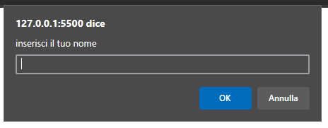
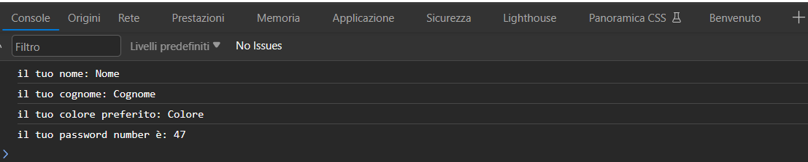
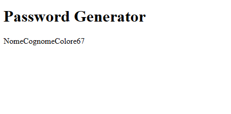

# Password generator

_HTML+js_

Creazione di una password tramite inserimento dati da parte dell' utente.

Nome+Cognome+ColorePreferito+NumeroRandom

## HTML

### Collegare il file js al file HTML

Da inserire alla fine del `<body>`

```html
<script src="pswdgen.js"></script>
```

### Crezione di un div con id=password

Sarà il div che darà come output la password inserita tramite prompt js

```html
<div id="password"></div>
```

## JS

### Inserimento di use strict

Viene inserito all' inizio del file per avere un ulteriore controllo su eventuali errori che vanno contro la convenzione d' uso.

```js
"use strict";
```

### Creazione delle variabili

Creo le variabili come `const`; è convenzione crearle prima `const` ed eventualmete cambiarle a `let` in base a come si evolve il problema.

- elementPassword

```js
const elementPassword = document.getElementById("password");
```

Inizializzo la variabile e le assegno il valore `document.getElementById("password");` che tradotto a parole significa:
_valore = elemento nel documento che ha come id 'password'_ (si collega al div creato nel file index.html).

- elementName - elementSurname - elementColor

```js
const elementName = prompt("inserisci il tuo nome");
const elementSurname = prompt("inserisci il tuo cognome");
const elementColor = prompt("inserisci il tuo colore preferito");
```

Inizializzo la variabile e le assegno il valore `prompt("inserisci il tuo nome/cognome/colore preferito")` che tradotto a parole significa:
_valore = stringa inserita dall' utente nel prompt_



- elementNumber

```js
const elementNumber = Math.floor(Math.random() * 100);
```

Inizializzo la variabile e le assegno il valore `Math.floor(Math.random() * 100)` che tradotto a parole significa:
_valore = arrotonda per difetto il numero random (compreso tra 0 e 1) e moltiplicalo per 100 (per avere un numero intero)_.

### Visualizzazione delle varibili nella console

Riscontro visivo delle operazioni effettuate in precedenza

```js
console.log("il tuo nome: " + elementName);
console.log("il tuo cognome: " + elementSurname);
console.log("il tuo colore preferito: " + elementColor);
console.log("il tuo password number è: " + elementNumber);
```

`console.log` permette di visualizzare il valore della varibile sulla console.



### Visualizzazione della password sul file html

```js
elementPassword.innerHTML =
  elementName + elementSurname + elementColor + elementNumber;
```

elementPassword, collegato a `<div id="password"></div>`, scrive la password sul sito (tramite il comando `.innerHTML`)


